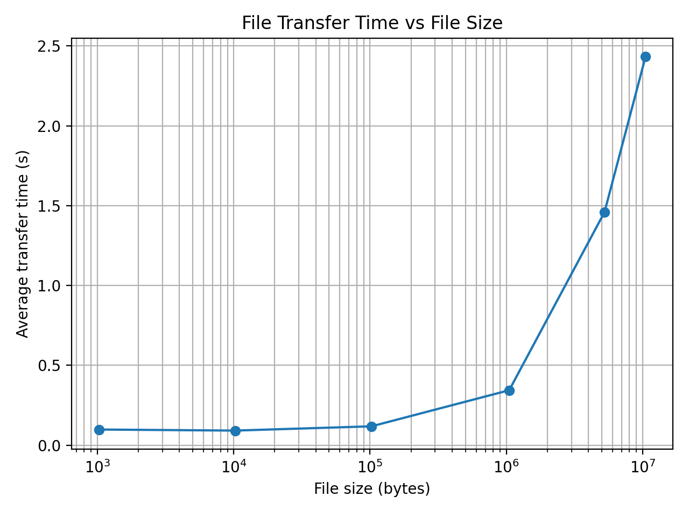

# pa_1

Repository: https://github.com/rahulsaravanakumar/pa_1

The transfer is limited by synchronous, one-chunk-at-a-time round-trips.
The client sends one file chunk request, waits for the server to reply, then writes and repeats. 
That creates a lot of small request and response cycles, which takes time because they are synchronous.
